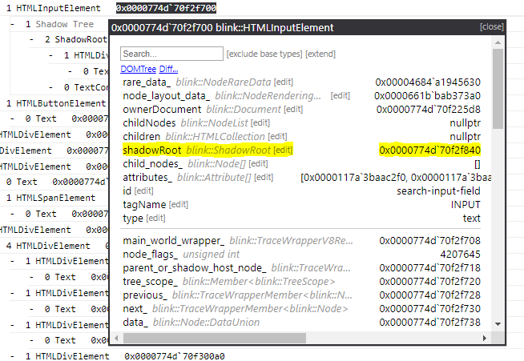
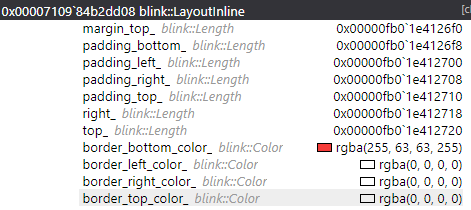
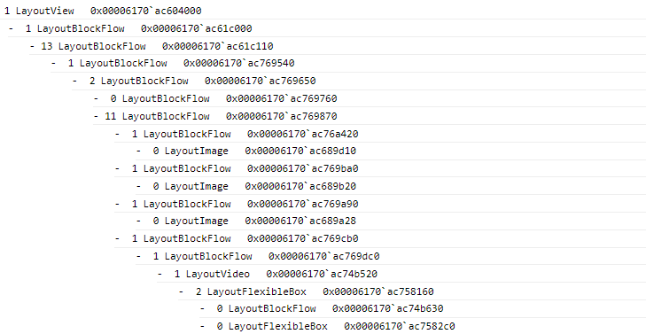

# JsDbg features

There are several features in JsDbg that can help browser developers have a more productive debugging experience. Some of the common ones are listed below.

## Tree Inspection

JsDbg extensions can be used to visualize large and complex data structures. The `tree-inspector` extension provides a convenient UI for tree structures. Below is an example of the tree inspector being used with the DOMTree extension to inspect the DOM for a YouTube video page.

## Type exploration

The `type-explorer` extension provides an interactive way to explore a type and its associated fields. It can be used in two ways. The first way is to inspect a particular object. Below is a screenshot of the type explorer being used with the AXTree extension - an extension to view the accessibility tree - to explore the attributes associated with a form.

The second way is to explore information across all objects of a particular type. Below is an example of the type explorer being used with the CCLayerTree extension - an extension to view the layer tree - to look at the position of all layers.

## Helper fields

JsDbg also allows users to add helper fields to types. These fields can be used to provide users with information beyond the native fields of an object. There are three types of additional fields that can be added: extended fields, array fields, and type descriptions.

### Extended fields

An extended field is a helper field that returns a 'pointer' to a single object. The object that represents the field's value can be explored using the type explorer just like any other object. Below is an example of an extended field on `blink::Element` to retrieve the `blink::ShadowRoot` that it hosts.

### Array fields

Unlike extended fields that return a single object, array fields return an array of zero or more objects that can then be expanded individually. For example, below is a screenshot of an array field to view the `blink::Attribute`s associated with a `blink::Element`.

### Type descriptions

Type descriptions are fields that return a string type. An example of where this is useful is the `data` type description on `blink::CharacterData` (`blink::Text` is a specialization of `blink::CharacterData`).

#### Primary vs. non-primary type descriptions

If a type description is defined as the "primary" description for a type, it will appear in place of the object's address in the type explorer. Below are two examples comparing primary vs. non-primary type descriptions. The first is a non-primary type description, `tagName` for `blink::Element`, while the second is a primary type description, `Text` for `WTF::String`.

#### HTML/CSS formatting

HTML/CSS formatting can also be applied to the string returned by a type description. For example, `blink::Color` has a primary type description that not only returns a string for the RBGA values, but also includes an inline-block to show the color.

### Seeing how a helper field is implemented

In addition to looking at the JsDbg source code, if a helper field is implemented to be "user editable", users can view its implementation from within the browser by clicking on the `[edit]` button next to the field. For instance, the `attributes_` array field (from the array fields example above) is user editable.

### Writing helpers fields

#### Invoking other fields

When writing a helper field, developers can invoke other helper fields, as well as native fields, as part of the implementation. The syntax for invoking each type of field is as follows:

  - Native field: `.f("[field name]")`, or the `.` operator when already in the context of a `.f` command. In other words, `.f("[field name]").f("[nested field name]")` is equivalent to `.f("[field name].[nested field name]")`.
  - Extended field: `.F("[extended field name]")`, or the `.` operator when already in the context of a `.F` command. In other words, `.F("[extended field name]").F("[nested extended field name]")` is equivalent to `.F("[extended field name].[nested extended field name]")`.
  - Array field: `.array("[array field name]")`
  - Type description: `.desc()` for primary type descriptions, and `.desc("[type description name]")` for non-primary descriptions.

Below are two examples of helper fields that are constructed using other fields. The first, `shadowRoot` on `blink::Element`, invokes two extended fields and two native fields, while the second, `type` on `blink::HTMLInputElement`, invokes an array field, two (primary) type descriptions and two native fields.

    DbgObject.AddExtendedField(Chromium.RendererProcessType("blink::Element"), "shadowRoot", Chromium.RendererProcessType("blink::ShadowRoot"), UserEditableFunctions.Create((element) => {
        return element.F("rare_data_").F("element_rare_data_").f("shadow_root_.raw_").vcast();
    }));

    DbgObject.AddTypeDescription(Chromium.RendererProcessType("blink::HTMLInputElement"), "type", false, UserEditableFunctions.Create((inputElement) => {
        return Promise.filter(inputElement.array("attributes_"), (attribute) => {
            return attribute.f("name_").desc()
            .then((attributeName) => (attributeName == "type"));
        })
        .then((attribute) => {
            console.assert(Array.isArray(attribute) && (attribute.length == 1));
            return attribute[0].f("value_").desc();
        });
    }));

#### Personal helper fields

Many helper fields are implemented as part of the JsDbg source code so that they are available to all users. However, the tool also allows users to implement their own custom fields from within the browser itself. This can be useful when writing a helper field that is temporary or does not need to be shared broadly. When inspecting a type in the type explorer, users can edit existing helper fields using the `[edit]` button or add a new helper field using the `[extend]` button. The example below shows the addition of a helper field from the browser to `blink::Element` that adds a light green background color to elements in the DOM tree that use a shareable element data object (to indicate possible sharing).

## Actions

Developers can also use JsDbg to explore relationships between browser components. Several JsDbg extensions visualize key components of the browser pipeline, such as DOMTree and LayoutObjectTree. Users can use these extensions in combination see how objects flow through the pipeline. Actions - links that allow objects encountered in one extension to be explored in another - provide a convenient way to do this. Below is an example of using an action to launch the LayoutObjectTree extension from the DOMTree extension when a DOM node's layout object is explored.

## Post-mortem debugging support

JsDbg extensions are not only useful in live debugging scenarios, but are also helpful for post-mortem debugging, ie. inspecting crash dumps. When F12 and helper functions are no longer available, JsDbg's visualizations continue to work, and can therefore help browser developers assess state contained within a dump.
