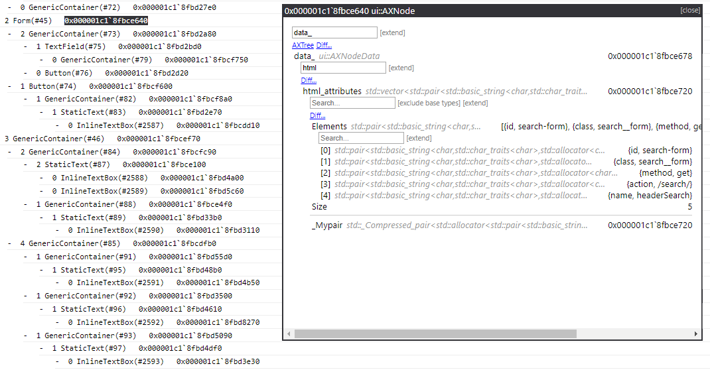
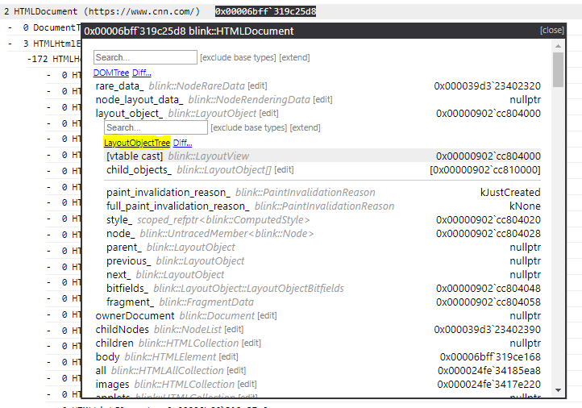

# JsDbg: Browser-based debugging extensions
JsDbg is a tool that provides browser developers with a web-based platform for native debugger extensions. Browser developers can use this tool to visualize large and complex data structures within the web platform, such as the DOM tree and accessibility tree. Unlike traditional debugging extensions that are debugger specific, JsDbg extensions are written with web technologies to run in the browser, which allows them to work across platforms and debuggers. By leveraging the benefits of HTML/CSS/JS, the extensions can also have richer user interfaces and functionality than what is typically present in a debugging extension.

# Using JsDbg

## Supported debuggers and platforms

JsDbg currently supports WinDbg and the Visual Studio debugger on Windows. Support for additional debuggers (ex. GDB) and platforms (ex. MacOS) will be available in the future. If you wish to use JsDbg with a debugger that is currently unsupported, please file an issue (or upvote an existing one) to track your request.

## JsDbg for WinDbg

### Setup

1. Download the [JsDbg WinDbg extension](https://aka.ms/jsdbg-windbg). (This extension changes infrequently because JsDbg extensions can be updated without updating the WinDbg extension. [Last update: Jan 30th, 2019])

2. Copy jsdbg.dll into the `winext` folder located next your `windbg.exe` installation. Make sure to use the x64 version of the dll for 64-bit WinDbg, and the x86 version for 32-bit WinDbg.

### Usage

1. Attach WinDbg to the desired Microsoft Edge or Chromium process.

2. In the WinDbg command window, run `!jsdbg.jsdbg`, or `.load jsdbg.dll` followed by `!jsdbg`.

3. The JsDbg server will launch and prompt you to select a browser. If the debugger is attached to one browser, it is recommended that you choose a different browser for JsDbg.

## JsDbg for Visual Studio

### Setup

1. Install the [JsDbg Visual Studio (VS) extension](https://aka.ms/jsdbg-visualstudio). (This extension should be able to update without a re-install. To install the update, restart VS, use the extension once, and then restart VS again.)

### Usage

1. Attach the VS debugger to the desired Microsoft Edge or Chromium process.

2. Break into the running process using the `Pause` icon on the Debug toolbar, or `Debug -> Break All`.

3. Launch JsDbg by clicking the `JS` icon on the Debug toolbar, or `Tools -> Launch JsDbg`.

4. The JsDbg server will launch and prompt you to select a browser. If the debugger is attached to one browser, it is recommended that you choose a different browser for JsDbg.

## Using JsDbg extensions

There are several ways browser developers can incorporate JsDbg extensions into their debugging workflow. Some common usages are listed below.

JsDbg extensions can be used to visualize large and complex data structures, such as the DOM tree. Below is an example showing the use of the DOMTree extension to inspect the DOM for a YouTube video page.

JsDbg also provides an interactive way to explore a type and its associated fields. This feature is called the type explorer. It allows users to inspect an object and its relationships in great detail, and see a broader picture than what is generally possible with just a debugger. Below is a screenshot of the type explorer being used with the AXTree extension - an extension to visualize the Chromium accessibility tree - to explore the HTML attributes associated with a form.

In addition to type exploration, developers can also use JsDbg to explore relationships between browser components. Several JsDbg extensions visualize key components of the browser pipeline, such as DOMTree and LayoutObjectTree. Users can use these extensions in combination see how objects flow through the pipeline. Actions - links that allow objects encountered in one extension to be explored in another - provide a convenient way to do this. Below is an example of using an action to launch the LayoutObjectTree extension from the DOMTree extension when a DOM node's layout object is explored.

JsDbg extensions are not only useful in live debugging scenarios, but are also helpful for post-mortem debugging, ie. inspecting crash dumps. When F12 and helper functions are no longer available, JsDbg's visualizations continue to work, and can therefore help browser developers assess state contained within a dump.

# Contributing

This project welcomes contributions and suggestions. Most contributions require you to agree to a
Contributor License Agreement (CLA) declaring that you have the right to, and actually do, grant us
the rights to use your contribution. For details, visit https://cla.microsoft.com.

When you submit a pull request, a CLA-bot will automatically determine whether you need to provide
a CLA and decorate the PR appropriately (e.g., label, comment). Simply follow the instructions
provided by the bot. You will only need to do this once across all repos using our CLA.

See [Contributing to JsDbg](./CONTRIBUTING.md) for more details about contributing to this project.

# Code of Conduct

This project has adopted the [Microsoft Open Source Code of Conduct](https://opensource.microsoft.com/codeofconduct/).
For more information see the [Code of Conduct FAQ](https://opensource.microsoft.com/codeofconduct/faq/) or
contact [opencode@microsoft.com](mailto:opencode@microsoft.com) with any additional questions or comments.