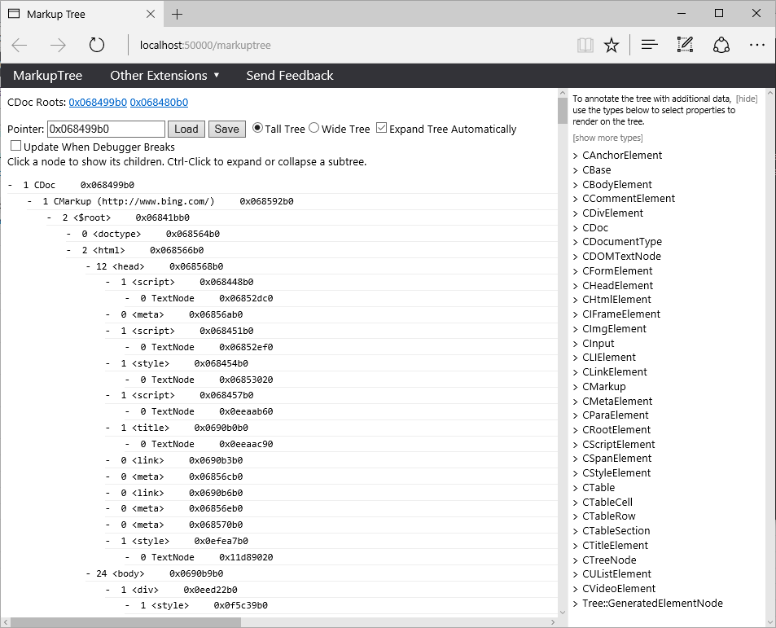
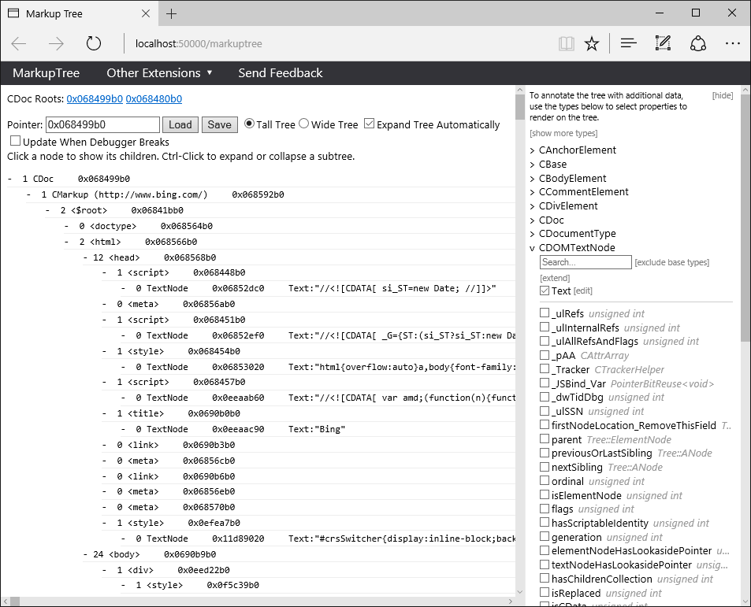
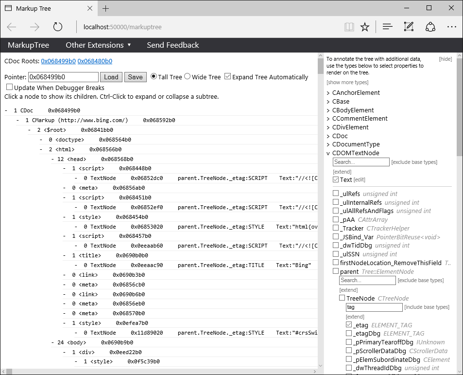
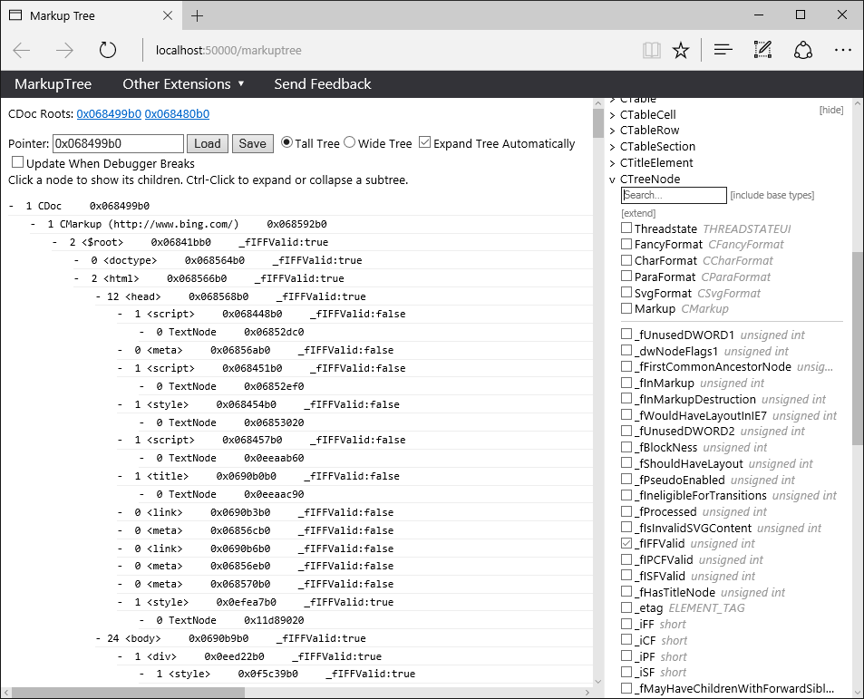
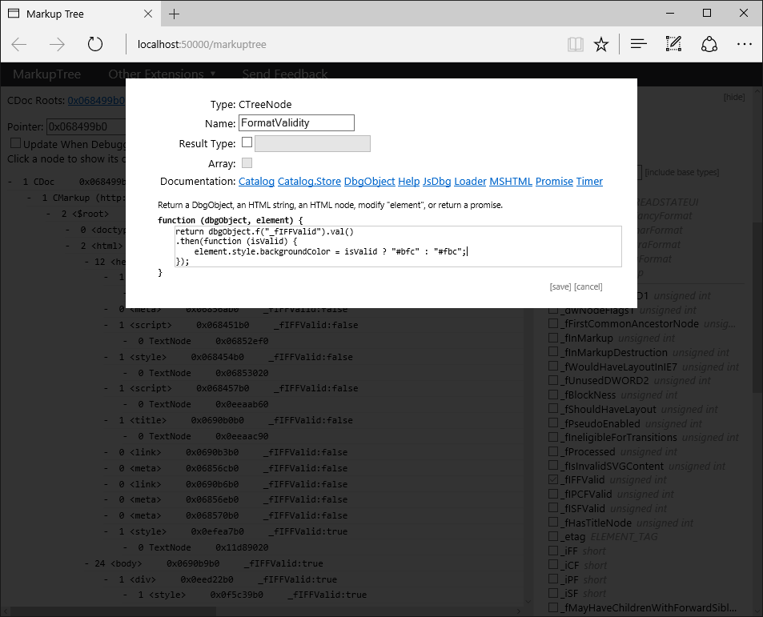
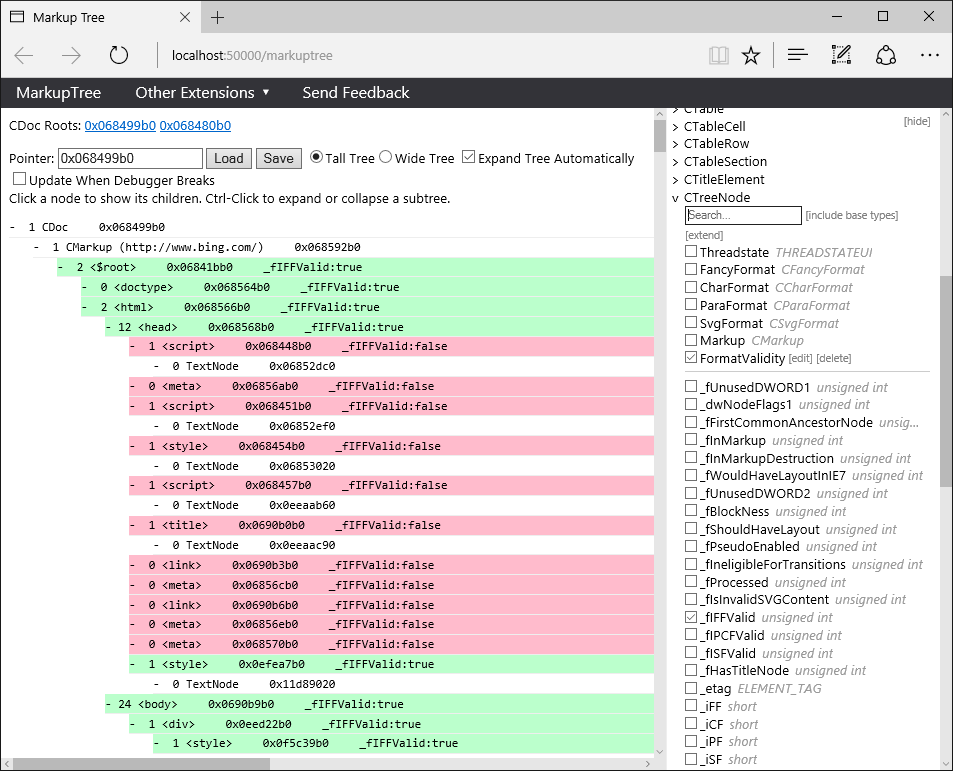

# JsDbg: debugger extensions in the browser
JsDbg is a platform for debugger extensions that are written in HTML/JS/CSS and run in the browser.  JsDbg extensions can have rich user interfaces and visualizations, but are easier to write than traditional debugger extensions.  JsDbg extensions are also debugger-agnostic and can be used with either WinDbg or Visual Studio 2015.

## Using JsDbg

The current JsDbg extensions are targeted at developers working on Microsoft Edge and Internet Explorer (specifically `edgehtml.dll` and `mshtml.dll`), but are approachable enough that anyone can follow along to get a feel for JsDbg.

### WinDbg

1. Attach WinDbg to a process that hosts `edgehtml.dll` or `mshtml.dll` (`MicrosoftEdgeCP.exe`, `iexplore.exe`, `WWAHost.exe`, etc.)

2. In the WinDbg command window, run
    ```
    !jsdbg
    ```

3. The JsDbg server will launch and prompt you to select a browser. If the debugger is attached to one browser, using a different browser for JsDbg generally works best; e.g. if the debugger is attached to Edge, use Chrome or IE.

### Visual Studio 2015

1. If you haven't already, install JsDbg for Visual Studio 2015 by opening
    ```
    \\iefs\users\psalas\jsdbg\JsDbg.VisualStudio.vsix
    ```
and restarting Visual Studio if necessary.

2. Open Visual Studio and attach to a process that hosts `edgehtml.dll` or `mshtml.dll` (`MicrosoftEdgeCP.exe`, `iexplore.exe`, `WWAHost.exe`, etc.)

3. Once attached, break in to the running process (the "Pause" icon on the Debug toolbar, or `Debug -> Break All`).

4. Launch JsDbg by clicking the "JS" icon on the Debug toolbar or `Tools -> Launch JsDbg`.

5. You will be prompted to select a browser. If the debugger is attached to one browser, using a different browser for JsDbg generally works best; e.g. if the debugger is attached to Edge, use Chrome or IE.

### Included Extensions

The most powerful extensions are the ones that show you the "three trees" of Trident: the markup (MarkupTree), layout (BoxTree), and display trees (DisplayTree).

MarkupTree, for example, will display the internal representation of the DOM.  Here's a look at the DOM of bing.com:

 

Seeing structure is useful, but since this extension is interactive we can inspect properties of the tree.  If we want to see the text in each text node, we can click on the CDOMTextNode type and enable the "Text" field to see the contents of the text nodes:



Just below "Text" you can see all the fields on the CDOMTextNode type; we could show any of them as well.  Or, similar to a watch window, we can expand those fields by clicking the type name.  For example, the parent element's tag:



One of the most powerful parts of the tree viewer is being able to add your own custom properties or visualizations.  One of the fields on `CTreeNode` is `_fIFFValid` which indicates whether the computed styles are up-to-date for that element.  Of course, seeing the value is trivial:



But with a little bit of JavaScript, we can visualize this value more easily across the tree.  Just below each type is the "Extend" button, which lets you write visualizations or even synthetic fields, defined solely in script!  We'll write some code that reads the value of the `_fIFFValid` field and sets the background to red or green accordingly:



And the final result:



With the visualization applied, it's easy to see that most of the nodes underneath the `<head>` element don't have styles computed, which makes sense because they're not rendered.  The code you write is automatically saved so that it will be available the next time you use the extension.

## Writing New Extensions or Contributing to JsDbg

If you're interested in writing a new extension or contributing to JsDbg see [CONTRIBUTING.md](./CONTRIBUTING.md).

## Questions?

Contact PSalas with any questions or suggestions!